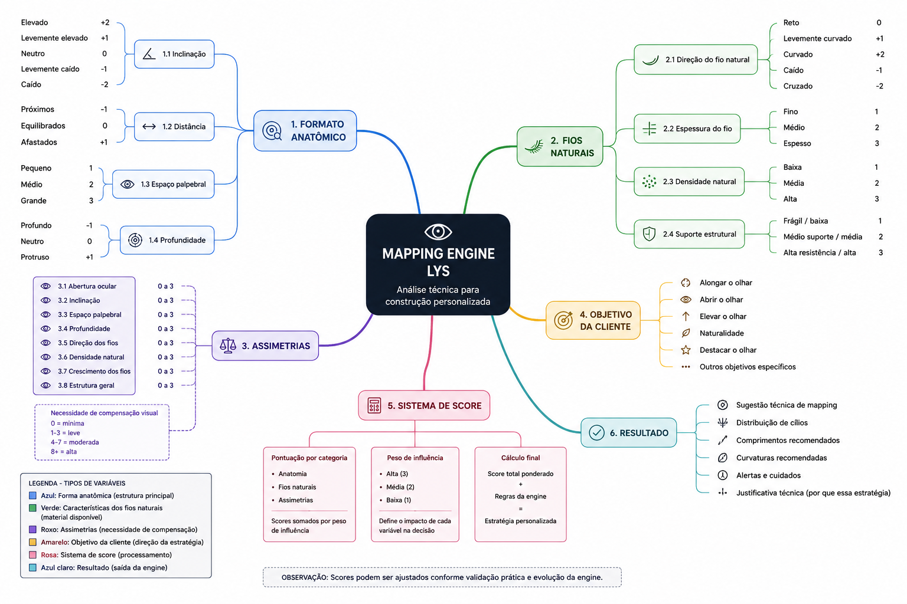

# Mapping Engine (LYS)

Primeira versão da estrutura lógica da engine responsável pela análise técnica do olhar e geração de estratégias de mapping personalizadas.

## Componentes atuais

- Formato anatômico
- Fios naturais
- Assimetrias
- Objetivo da cliente
- Sistema de score
- Resultado técnico

## Arquitetura inicial

Status: Em evolução (v0.1)
