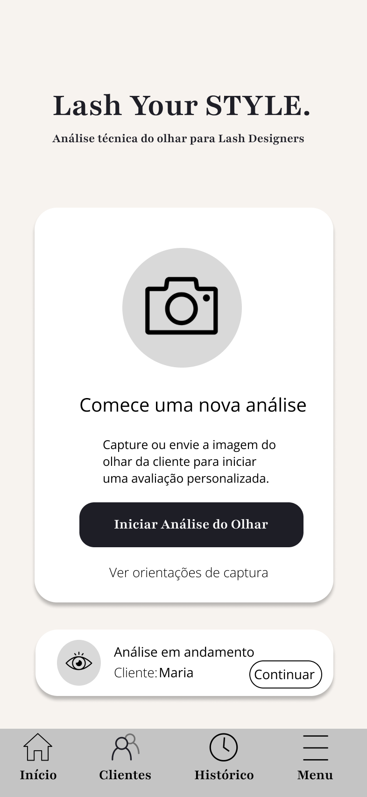
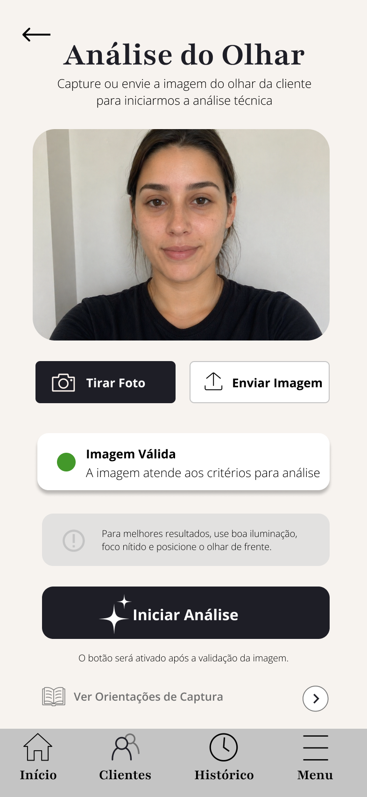
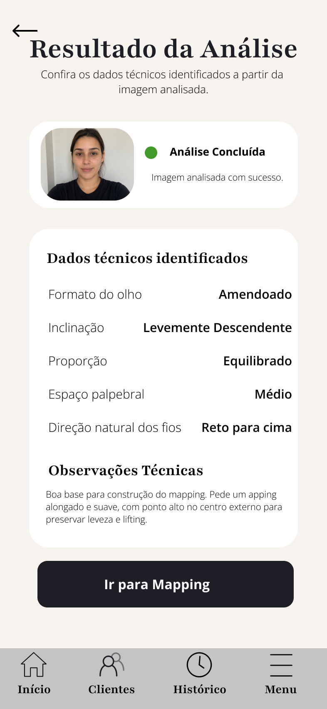

# Lash Your Style (LYS)

Aplicativo profissional para lash designers focado em análise morfológica do olhar, construção técnica de mapping personalizado e simulação visual baseada em fios reais.

---

## Sobre o projeto

O Lash Your Style (LYS) nasceu da necessidade de transformar a análise técnica do olhar em um processo mais preciso, visual e padronizado dentro do atendimento profissional de extensão de cílios.

O objetivo do aplicativo é auxiliar lash designers na tomada de decisões técnicas através da interpretação morfológica do olhar, construção personalizada de mapping e visualização prévia do resultado final.

Diferente de aplicativos baseados em filtros genéricos, o LYS busca funcionar como uma ferramenta técnica profissional.

---

## Problema

Muitas clientes escolhem referências visuais incompatíveis com sua anatomia ocular, enquanto muitas profissionais realizam análises superficiais ou difíceis de explicar visualmente durante o atendimento.

Isso pode gerar:
- baixa previsibilidade do resultado
- dificuldade de comunicação
- escolhas técnicas inconsistentes
- resultados desalinhados com o potencial do olhar

---

## Solução proposta

O LYS propõe um fluxo técnico dividido em etapas:

1. Captura e validação da imagem
2. Análise morfológica do olhar
3. Identificação de pontos fortes e pontos de atenção
4. Construção personalizada de mapping
5. Simulação visual baseada em fios reais
6. Comparação de resultados e histórico

---

## Funcionalidades planejadas

- Análise do olhar
- Construção técnica de mapping
- Simulação visual
- Histórico de atendimentos
- Comparação de resultados
- Fluxos guiados para atendimento
- Feedback visual inteligente

---

## Protótipo Inicial

### Tela Inicial


---

### Fluxo de Análise


---

### Resultado da Análise

## Estrutura do projeto

```text
docs/
→ documentação geral do produto

diagramas/
→ arquitetura, C4, UML e BPMN

prototipo/
→ telas, fluxos e estrutura visual

requisitos/
→ requisitos funcionais e histórias de usuário

estudos/
→ pesquisas e referências

assets/
→ imagens e elementos visuais
```

---

## Áreas envolvidas no projeto

- UX/UI Design
- Engenharia de Software
- Arquitetura de Sistemas
- Prototipagem
- Análise de Requisitos
- Simulação Visual
- Experiência do Usuário

---

## Status do projeto

Em fase de documentação, arquitetura e prototipagem.

---

## Próximos passos

- Organização dos fluxos do aplicativo
- Finalização das telas do protótipo
- Estruturação da arquitetura inicial
- Definição das regras de análise
- Exploração das tecnologias do MVP

---
