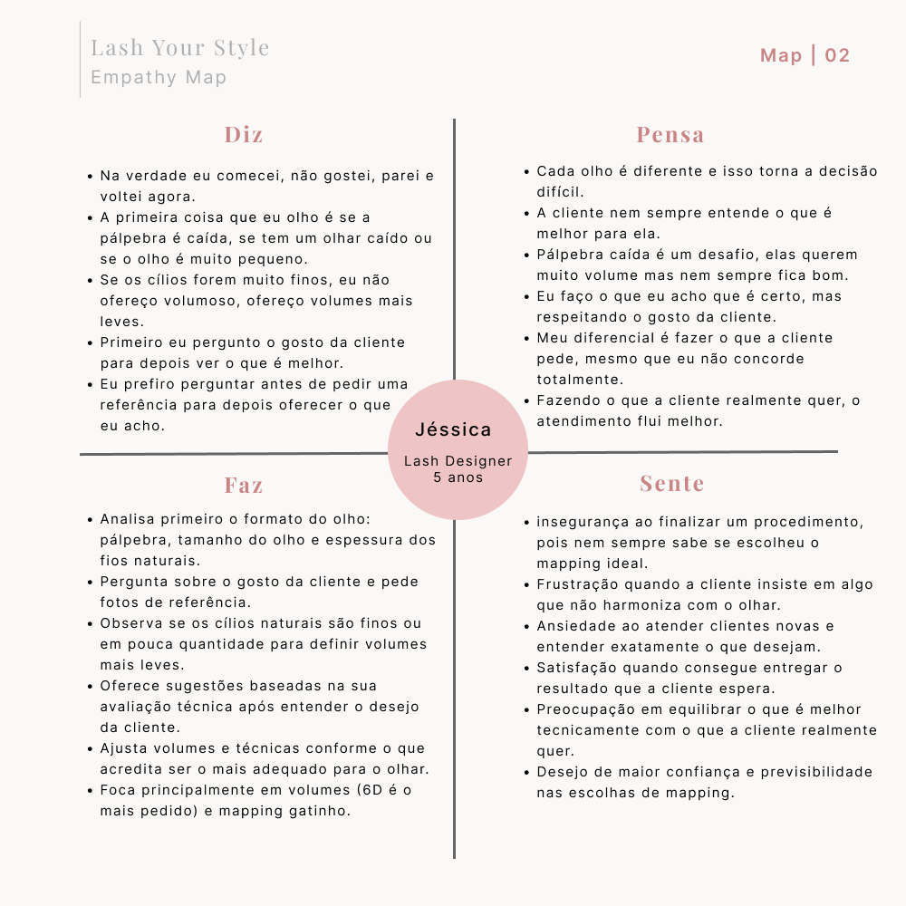
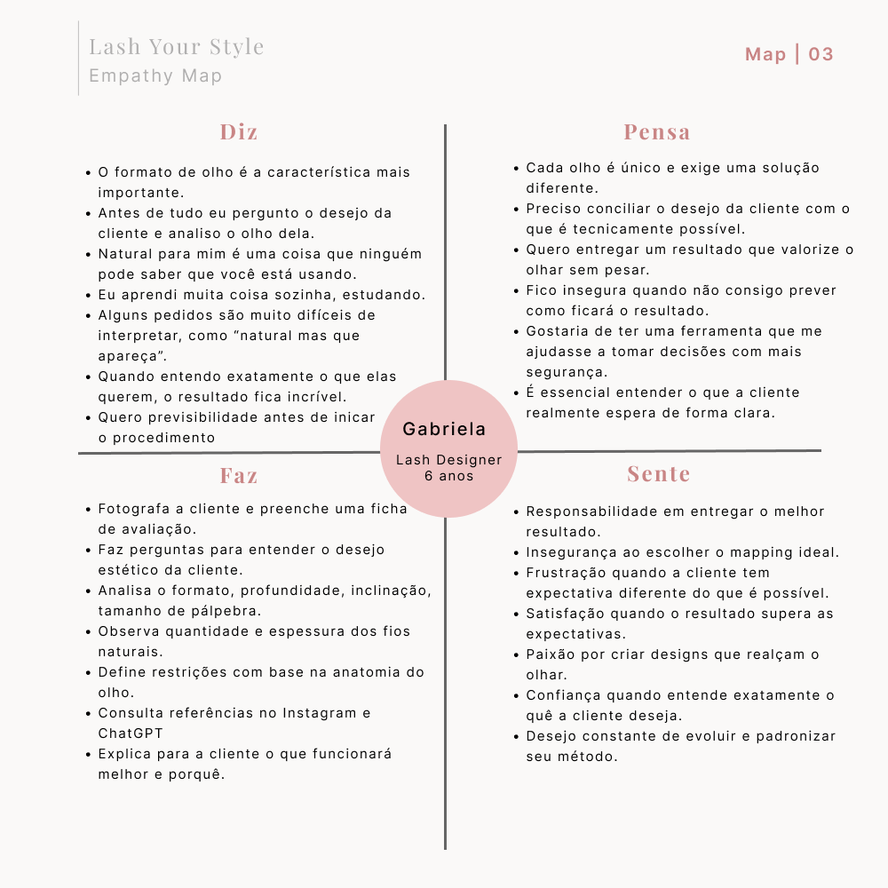

# Empathize

A etapa **Empathize** teve como objetivo compreender como lash designers pensam, trabalham e tomam decisões durante o processo de criação de um mapping.

Para isso, foram realizadas entrevistas qualitativas com profissionais da área. Os principais aprendizados foram sintetizados em Mapas de Empatia, que serviram como base para a etapa **Define**.

## Pesquisa

Foram realizadas **3 entrevistas semiestruturadas com lash designers**, buscando compreender:

- como analisam as características da cliente;
- como interpretam o desejo estético;
- como escolhem o mapping;
- quais dificuldades encontram durante essa decisão;
- quais necessidades e oportunidades existem nesse processo.

## Mapas de Empatia

A partir das entrevistas, foram construídos mapas individuais para representar os principais pensamentos, sentimentos, comportamentos, dores e ganhos identificados durante a pesquisa.

### Participante 01

### Participante 02

### Participante 03

## Próxima etapa

Os aprendizados obtidos durante a pesquisa serão utilizados na etapa **Define**, apoiando a construção da persona, história de usuário, definição do problema e proposta de valor.
